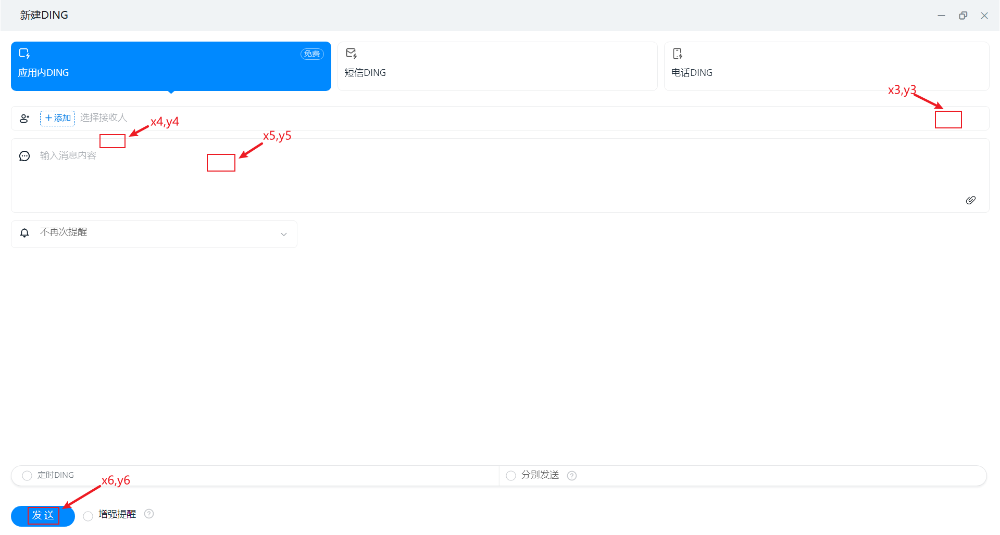

# AutoDing使用指南

- 通过GetCoordinate程序获取6个位置的坐标

  - 在命令行上执行GetCoordinate，并在10s内将鼠标放到指定位置
  - **(x1,y1)**
    - 
  - **(x2,y2)**
    - 
  - **(x3,y3)** **(x4,y4)** **(x5,y5)** **(x6,y6)**
    - 

- 通过ding程序执行自动化Ding

  - 命令行执行如下命令（起始位置从0开始，结束位置为名单长度，即左闭右开）

  - ```
    ding.exe -f "xlsx文件路径" -s 起始位置 -e 结束位置 -x1 新建的x坐标 -y1 新建的y坐标 -x2 放大窗口的x坐标 -y2 放大窗口的y坐标 -x3 选择接收人的x坐标 -y3 选择接收人的y坐标 -x4 确定姓名的x坐标 -y4 确定姓名的y坐标 -x5 输入消息内容的x坐标 -y5 输入消息内容的y坐标 -x6 发送的x坐标 -y6 发送的y坐标
    ```

  - 在5s内让电脑窗口处于如下状态

    - 

